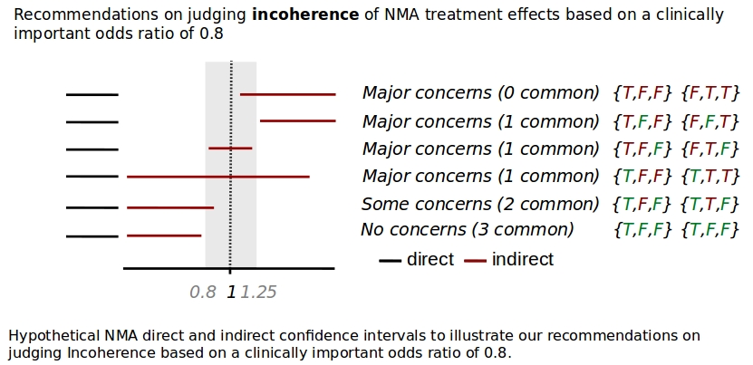

Below you can find a brief guide of using CINeMA to evaluate confidence
in network meta-analysis treatment effects.

My projects
===========

CINeMA requires a .csv file with the study **outcome** data and study-level
**risk of bias** (RoB) and **indirectness** judgements which you can upload in My Projects. We
describe below how the data should be formatted.

Binary data
-----------

####long format

If your outcome is binary, there are two possible formats to upload your
data. The first is a long format, where each treatment arm occupies one
row.

**Example binary format 1 (long):**

  id  |  t |  r  | n   | rob | indirectness
  ----|--- |---  | ----| --- | :---:
  1    |A   |5   | 12  | 2   | 1  
  1    |B   |7   |15   | 2   | 1   
  2    |A   |6   | 9   | 3   | 2   
  2    |B   |7   |10   | 3   | 2   
  2    |C   |2   |8    | 3   | 2   

  field | description - long-binary
  ----- | -----------
id   |  specifies the study and has to be numeric
 t   |  specifies the treatment code and it can be either numeric or string
 r   |  is the number of events                                 
 n   |  is the sample size                                                                                            
 rob |  specifies risk of bias. It can take either 1, 2 and 3 or L, U, H values for low, unclear and high risk of bias
indirectness |  specifies indirectness, levels are the same as in risk of bias


####wide format
In the second format, each row represents a comparison. The number of
rows that each study occupies equals the number of comparisons that it examines.
Two arm studies (studies with two treatment arms) occupy one
row, three arm studies occupy three rows, four arm studies occupy six
rows etc.

**Example binary format 2 (wide):**

  id  | t1  | r1  | n1  | t2  | r2  | n2  | rob  | indirectness               
  ----| ----| ----| ----| ----| ----| ----| -----| -----
  1   | A   | 5   | 12  | B   | 7   | 15  | 2    | 1    
  2   | A   | 6   | 9   | B   | 7   | 10  | 3    | 2    
  2   | A   | 6   | 9   | C   | 2   | 8   | 3    | 2    
  2   | B   | 7   | 10  | C   | 2   | 8   | 3    | 2    
                                              
field | description / wide-binary
----- | -----------
  id     |  specifies the study and has to be numeric
  t1, t2 |  specifies the treatment codes and it can be either numeric or string                                            
  r1, r2 |  number of events in treatments t1 and t2
  n1, n2 |  sample size in treatments t1 and t2
  rob    |specifies risk of bias. It can take either 1, 2 and 3 or L, U, H values for low, unclear and high risk of bias
  indirectness |  specifies indirectness, levels are the same as in risk of bias

### Continuous data
  If your outcome is continuous, there are two possible formats that you
can upload your data. The first is a long format, where each treatment
arm occupies one row.

####long format
**Example continuous format 1 (long):**

  id  | t  | y  | sd  | n   | rob  |  indirectness
  ----| ---| ---| ----| ----| -----|  :---:
  1   | A  | 5  | 5   | 12  | 2    |  1      
  1   | B  | 7  | 6   | 15  | 2    |  1      
  2   | A  | 6  | 7   | 9   | 3    |  2      
  2   | B  | 7  | 8   | 10  | 3    |  2      
  2   | C  | 2  | 9   | 8   | 3    |  2      


field | description / long-continuous
----- | -----------
 id  | specifies the study and has to be numeric
 t   | specifies the treatment code and it can be either numeric or string
 y   | is the mean
 sd  | is the standard deviation
 n   | is the sample size
rob  |specifies risk of bias. It can take either 1, 2 and 3 or L, U, H values for low, unclear and high risk of bias
indirectness |  specifies indirectness, levels are the same as in risk of bias

####wide format
In the second format, each row represents a comparison. The number of
rows that each study occupies equals the number of comparisons that it
examines. Two arm studies (studies with two treatment arms) occupy one
row, three arm studies occupy three rows, four arm studies occupy six
rows etc.

**Continuous format 2 (wide):**

  id  | t1  | y1  | sd1  | n1  | t2  | y2  | sd2  | n2  | rob   | indirectness               
  ----| ----| ----| -----| ----| ----| ----| -----| ----| ----- | -----
  1   | A   | 5   | 5    | 12  | B   | 7   | 6    | 15  | 2     | 1    
  2   | A   | 6   | 7    | 9   | B   | 7   | 8    | 10  | 3     | 2    
  2   | A   | 6   | 7    | 9   | C   | 2   | 9    | 8   | 3     | 2    
  2   | B   | 7   | 8    | 10  | C   | 2   | 9    | 8   | 3     | 2    
                                                      

field | description / wide-continuous
----- | -----------
 id        | specifies the study and has to be numeric
 t1, t2    | specifies the treatment codes and it can be either numeric or string
 y1, y2    | mean in treatments t1 and t2
 sd1, sd2  | standard deviations in treatments t1 and t2
 rob       | specifies risk of bias. It can take either 1, 2 and 3 or L, U, H values for low, unclear and high risk of bias
indirectness |  specifies indirectness, levels are the same as in risk of bias

Inverse variance data
---------------------

It might be that there are not available summary data for each
intervention group for each study. In such a case, an overall estimate
of the effect and its standard error are collected. We provide below the
required format for this kind of data, which we call ‘inverse variance
data’.

**Example inverse variance data format:**

  id  |t1  |t2  |effect  |se   |rob  | indirectness               
  ----|----|----|--------|-----|-----| -----
  1   |A   |B   |0.5     |0.3  |2    | 1    
  2   |B   |D   |0.8     |0.2  |1    | 2    
  3   |A   |6   |0.7     |0.4  |3    | 2    
                                     
field | description / iv
----- | -----------
 id      | specifies the study and has to be numeric
 t1, t2  | specifies the treatment codes and it can be either numeric or string
 effect  | The effect estimate of t1 versus t2. It can be log odds ratio, log risk ratio, log hazard ratio, mean difference or standardized mean difference. In case that this format is used, you will be asked whether your data measure a binary, continuous or time to event outcome.
 se      | the standard error of the effect estimate
 rob     | specifies risk of bias. It can take either 1, 2 and 3 or L, U, H values for low, unclear and high risk of bias
indirectness |  specifies indirectness, levels are the same as in risk of bias


Notes for all data formats
--------------------------

1.  All fields described above are mandatory (depending on the format you
choose), but CINeMA allows for **custom field names**.

2.  Although one can place any treatment names on t, we encourage users
not to put string names with blanks or special characters. It is also preferable 
for names to be short, e.g. characters.

3.  You can have any other variables in the dataset you wish.

After uploading a dataset, information on the number of studies, number
of interventions and number of comparisons with direct data appears.

Configuration
=============

You can then go to Configuration where the network plot and the data
appear. Options of undertaking network meta-analysis also appear in this
page.

Network plot
------------

The network plot is automatically drawn with equally sized nodes and
edges. You can choose to weight nodes and/or edges according to the
sample size or the number of studies. Nodes can either be all blue or
colored according to the involved studies with low (green), unclear
(yellow) and high (red) risk of bias or indirectness.
Edges can be all black, colored
according to the average risk of bias or indirectness of the included studies 
(Average RoB/indirectness)
, colored according to the most prevalent bias/indirectness level within each
comparison (Majority RoB/indirectness) or colored according to the maximum 
bias/indirecntess level within each comparison (Highest RoB/indirectness). 
The network plot image can be exported as .png file using the ```Save Plot``` button.

Outcome data also appear next to the network plot. By clicking to a
specific edge or node, the respective outcome data corresponding to the
particular edge or node appear on the right.

Define you analysis
-------------------

Here you can choose:

a)  Whether you will use a fixed effect or a random effects model.

b)  The effect measure to be used.

c)  The intervention comparisons to appear. Selecting all interventions,
    the contributions of each pairwise to each network estimate will
    be calculated. For convenience, in particular in large networks, you
    may choose to display less than all network comparisons (rows in the
    contribution matrix). If this is the case, select the interventions
    you are interested in and specify whether you want to evaluate all
    the comparisons that contain this interventions (**Containing**) or only
    the comparisons that are formed between the selected
    interventions (**Between**). A list of the comparisons to be evaluated
    will appear. Note that the analysis is performed using all studies.

When your analysis is defined, press the ‘Setup your evaluation’ button.
The contribution matrix –which provides estimations on how much each
direct piece of evidence contributes to each network estimate- is
calculated. Press ‘Cancel’ if you wish to interrupt the calculations.

After the analysis is performed you can download: 
- the per study contribution matrix 
- the per comparison contribution matrix 
- the league table
```Reset your evaluation``` button deletes all previous choises and computations so use with
caution.
```Proceed``` takes you to the within-study bias domain and saves the state of
the procedure (If you refresh or close and revisit the site CINeMA will remember
where you were)

*Note: the choices in this step are of particular importance because
they will be kept throughout the evaluation process. **Only network
comparisons you have chosen here will appear in the next tabs.** *

Within-study bias
=================
<span id="rob"></span>

#### Risk of bias contributions

A bar graph will then be drawn which shows the contributions of each
study to the network estimate. The bars are colored
according to the bias level and their length is proportional to the
percentage contribution of each study to the network
estimates. You can download this figure as .png file using the ```Save
Chart``` button.

Select how to summarize risk of bias across contributions for each network estimate
-----------------------------------------------------------------------------------

You need to pick a selection rule for evaluating each network estimate
with respect to Study Limitations according to the risk of bias of
pairwise comparisons feeding into each estimation (Majority, Average,
Highest). **You can also manually change your judgments** independently of
the applied selection rules.

Across-studies bias
================

Lacking a concrete methodology of asseccing across-studies bias (publication bias) in NMA, users are limited to report whether they suspect or not the presence of bias on a per comparison level for the comparisons they selected to examine.

Indirectness
============

Indirectness domain is identical to [Within-study bias](#rob) where judgements
are informed from the study level judgement on indirectness the user has
provided on the dataset.

Imprecision
===========

Importance of imprecise treatment effects depends on whether their
confidence intervals include values that could lead into different
clinical decisions. You need to specify a clinically important size of
effect on the scale of your effect measure. After pressing ‘Set’ the
range of values to be considered as clinically important appear. As a
default, imprecision judgements are formulated as follows: we
characterize as very serious in terms of imprecision network estimates
whose confidence intervals cross both limits of the clinically important
effects zone. If only one of the two values is crossed by network
estimates’ confidence intervals they are characterized as serious and
not serious applies to those estimates that do not cross neither value.
The hypothetical forest plot below serves as an illustration of the
strategy we apply to judge upon imprecision of network treatment effects
based on a clinically important odds ratio of 0.8.


Heterogeneity
=============

Importance of heterogeneity depends on the variability of effects in
relation to the clinically important size of effect. The clinically
important value needs to be the same as in Imprecision; if already
specified it will automatically appear on the top of Heterogeneity.
Otherwise, it needs to be specified here and will be inherited in
Imprecision. We make use of prediction intervals to prepopulate
judgments on heterogeneity and its implications on the quality of the
network treatment effects. In particular, we judge the agreement of
conclusions based on confidence and prediction intervals in relation to
the clinically important effect size. Our judgements based on a
hypothetical clinically important odds ratio of 0.8 are summarized and
illustrated in the table and in the figure below.

We measure the number of crossings of the confidence and prediction interval with the clinical important interval and judge their agreement using the following table:

|0 Prediction interval crossings | 1 Prediction interval crossings | 2 Prediction interval crossings |
 -----------------------------|   |   |  |
 **0 Confidence interval crossings  ** | No serious | Serious    | Very serious
    **1 Confidence interval crossings **  | NA         | No serious | Serious
    **2   Confidence interval crossings **| NA         | NA         | No serious

Summary of recommendations on judging heterogeneity of NMA treatment
effects based on a clinically important odds ratio of 0.8.


The estimated value of between-study variance for the network
meta-analysis is displayed. It is also possible to view between-study
variance estimates for each direct comparison along with reference
intervals specific to the outcome and types of compared interventions
[[1](#Turner),[2](#Rhodes)]. If critical appraisal of those lead to changing conclusions
formulated by considerations based on predictive intervals, users can
amend heterogeneity judgments manually.

Incoherence
===========

We propose assessing incoherence both globally (using the design by
treatment interaction model [[3](#White),[4](#Higgins)]) and locally (using the side splitting
approach [[5](#Dias)]). Below, we describe the rules we use to prepopulate our
incoherence judgements.

We judge comparisons that only direct evidence exists as ‘no serious’
with respect to incoherence. For comparisons that only indirect
evidence exists, we judge incoherence as ‘no serious’, ‘serious’ and
‘very serious’ depending on whether the p-value of the design by
treatment interaction model is more 0.10, between 0.01 and 0.10 and less
than 0.01 respectively. In a similar to Heterogeneity manner we make use of confidence intervals of direct and indirect estimates to examine whether they agree.
To classify their agreement we partition into three areas:
- left from the clinically important zone A
- the clinically important zone itself B
- right from the clinically important zone C
An interval belongs to A and/or B and/or C areas.
One can define the boolean vector {a,b,c} describing the intervals
positioning.
In order to judge Incoherence we decided to look at the agreement of the direct
and indirect estimates concerning their positioning relative to the clinically important value.
The following table shows the 4 cases that the direct and indirect intervals can be found by expressing the number of areas they have in common, as well as the judgement implied.
Direct and indirect confidence intervals belonging to:

common areas | Incoherence judgement
------| ------
0 | **Major concerns**
1 | **Major concerns**
2 | **Some concerns**
3 | **No concerns**

The following examples showcase Incoherence judgements based on the above
rule.


Incoherence tab contains the chi-square statistic based on a
random-effects design by treatment interaction model and the
inconsistency factors in the scale of the effect measure using the side
splitting approach for comparisons that both direct and indirect
evidence is available.

Report
======

After assessing separately quality of evidence for each domain, go the
‘Report’ tab. Each row shows a network meta-analysis treatment effect
along with the judgements made for each domain. A gray line appears for
judgements that have been manually modified.

There are 4 levels of confidence for the final judgement of each NMA comparison:
- High
- Moderate
- Low
- Very low
One can place judgement once at least one domain has been reviewed. 
By pressing ```Reset``` all judgements are set to High.
The user can also download the final report as a ***csv*** by clicking the
```Download Report```.

References
==========

1\. <span id ="Turner">Turner RM, Davey J, Clarke MJ, Thompson SG, Higgins JP. Predicting
the extent of heterogeneity in meta-analysis, using empirical data from
the Cochrane Database of Systematic Reviews. Int J Epidemiol. 2012
Jun;41(3):818–27.
</span>

2\. <span id="Rhodes">Rhodes KM, Turner RM, Higgins JPT. Predictive distributions were
developed for the extent of heterogeneity in meta-analyses of continuous
outcome data. J Clin Epidemiol. 2015 Jan;68(1):52–60.
</span>

3\. <span id="White">White IR, Barrett JK, Jackson D, Higgins JPT. Consistency and
inconsistency in network meta-analysis: model estimation using
multivariate meta-regression. Res Synth Methods. 2012 Jun;3(2):111–25.
</span>

4\. <span id="Higgins">Higgins JPT, Jackson D, Barrett JK, Lu G, Ades AE, White IR.
Consistency and inconsistency in network meta-analysis: concepts and
models for multi-arm studies. Res Synth Methods. 2012 Jun;3(2):98–110.
</span>

5\. <span id="Dias">Dias S, Welton NJ, Caldwell DM, Ades AE. Checking consistency in
mixed treatment comparison meta-analysis. Stat Med. 2010 Mar
30;29(7–8):932–44.
</span>
